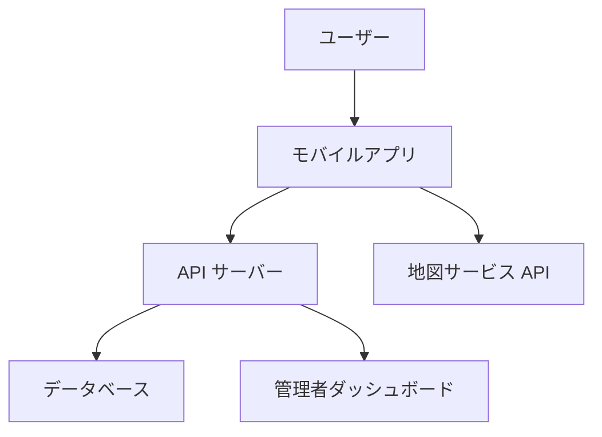

# 設計書

## 概要

このドキュメントでは、チュウニズム設置場所マップアプリケーションの設計について詳細に説明します。このアプリケーションは、ユーザーがゲームセンターに設置されているチュウニズム（音楽ゲーム）の筐体の場所を簡単に見つけられるようにするためのものです。

## アーキテクチャ

アプリケーションは以下のアーキテクチャを採用します：

### クライアントサイド
- **フロントエンドフレームワーク**: React Native（iOS/Android両対応）
- **状態管理**: Redux
- **マップ表示**: Google Maps API / MapKit（iOS）
- **オフラインサポート**: AsyncStorage / SQLite

### サーバーサイド
- **バックエンドAPI**: Node.js + Express
- **データベース**: MongoDB（位置情報に最適化）
- **認証**: Firebase Authentication
- **クラウドホスティング**: AWS / Google Cloud Platform

### アーキテクチャ図



## コンポーネントとインターフェース

### モバイルアプリコンポーネント

1. **マップビュー**
   - 現在地表示
   - 店舗マーカー表示
   - クラスタリング機能（多数のマーカーがある場合）
   - 地図操作（ズーム、パン）

2. **検索・フィルター**
   - バージョン別フィルター
   - 設備別フィルター（PASELI対応、大会対応など）
   - キーワード検索（店舗名、地域名）

3. **店舗詳細ビュー**
   - 基本情報表示
   - 経路案内機能
   - お気に入り登録機能
   - 情報更新提案機能

4. **オフラインモード**
   - データキャッシュ機能
   - オフライン通知
   - データ同期機能

### バックエンドコンポーネント

1. **API エンドポイント**
   - 店舗データ取得 API
   - 店舗フィルタリング API
   - ユーザー認証 API
   - 情報更新提案 API

2. **管理者ダッシュボード**
   - 店舗データ管理
   - 情報更新提案の承認/拒否
   - ユーザー管理

### インターフェース定義

#### 店舗データ API

```
GET /api/stores
パラメータ:
- lat: 緯度
- lng: 経度
- radius: 検索半径（km）
- version: チュウニズムバージョン（オプション）
- facilities: 設備フィルター（オプション、カンマ区切り）
```

```
GET /api/stores/:id
パラメータ:
- id: 店舗ID
```

#### 情報更新提案 API

```
POST /api/stores/:id/suggestions
パラメータ:
- id: 店舗ID
- field: 更新フィールド
- value: 更新値
- comment: コメント（オプション）
- userId: ユーザーID（認証済みの場合）
```

## データモデル

### 店舗（Store）

```json
{
  "id": "String",
  "name": "String",
  "address": "String",
  "location": {
    "type": "Point",
    "coordinates": [Number, Number] // [経度, 緯度]
  },
  "businessHours": {
    "monday": { "open": "String", "close": "String" },
    "tuesday": { "open": "String", "close": "String" },
    // 他の曜日も同様
  },
  "chunithmInfo": {
    "cabinets": Number,
    "versions": ["String"],
    "facilities": ["String"] // "PASELI", "TOURNAMENT", etc.
  },
  "specialNotice": "String",
  "lastUpdated": "Date",
  "updatedBy": "String",
  "photos": ["String"] // URL
}
```

### 情報更新提案（Suggestion）

```json
{
  "id": "String",
  "storeId": "String",
  "field": "String",
  "value": "Any",
  "status": "String", // "pending", "approved", "rejected"
  "comment": "String",
  "userId": "String",
  "anonymous": Boolean,
  "createdAt": "Date"
}
```

### ユーザー（User）

```json
{
  "id": "String",
  "username": "String",
  "email": "String",
  "favorites": ["String"], // 店舗ID
  "contributions": Number,
  "role": "String" // "user", "moderator", "admin"
}
```

## エラー処理

### クライアントサイド

1. **ネットワークエラー**
   - オフラインモードへの自動切り替え
   - ユーザーへの通知
   - 再接続時の自動リトライ

2. **位置情報エラー**
   - 位置情報が取得できない場合のフォールバック（デフォルト位置の表示）
   - ユーザーへの権限リクエスト

3. **データロードエラー**
   - ローディング状態の表示
   - エラーメッセージの表示
   - リトライ機能

### サーバーサイド

1. **データベースエラー**
   - トランザクション管理
   - エラーログ記録
   - クライアントへの適切なエラーレスポンス

2. **認証エラー**
   - 適切なHTTPステータスコードの返却
   - セキュリティ対策（レート制限、トークン検証）

3. **入力バリデーションエラー**
   - 詳細なエラーメッセージ
   - フィールド単位のエラー情報

## テスト戦略

### ユニットテスト

- **フロントエンド**: Jest + React Testing Library
- **バックエンド**: Mocha + Chai

### 統合テスト

- API エンドポイントのテスト
- データベース操作のテスト
- 認証フローのテスト

### E2Eテスト

- Detox（モバイル）
- Cypress（管理者ダッシュボード）

### パフォーマンステスト

- 大量のマーカー表示時のパフォーマンス
- API レスポンス時間
- オフライン/オンライン切り替え時の動作

### セキュリティテスト

- 認証・認可テスト
- 入力検証テスト
- APIアクセス制限テスト

## 実装の考慮事項

1. **スケーラビリティ**
   - 地理空間インデックスの活用
   - キャッシュ戦略
   - サーバーレスアーキテクチャの検討

2. **パフォーマンス**
   - マーカークラスタリングの実装
   - データのプリフェッチ
   - 画像の最適化

3. **ユーザーエクスペリエンス**
   - スムーズなアニメーション
   - 直感的なUI
   - 高速な初期ロード

4. **セキュリティ**
   - API キーの保護
   - ユーザーデータの暗号化
   - HTTPS の強制

5. **アクセシビリティ**
   - スクリーンリーダー対応
   - 色のコントラスト
   - キーボードナビゲーション（管理者ダッシュボード）